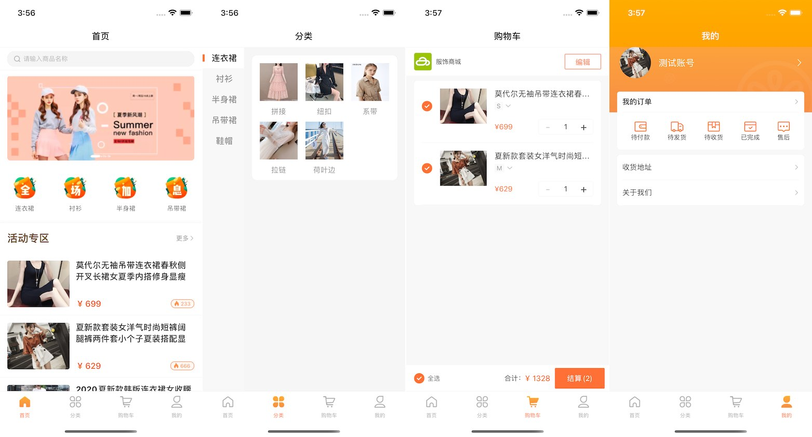

### 介绍

此源码为在线服饰商城类型，主要功能包括商品展示、商品搜索、购物车、订单管理等。包含前后端，其中前端代码使用 avm.js 多端技术开发，可同时编译为 Android & iOS App 以及微信小程序；后端使用 APICloud 数据云 3.0 云函数自定义接口。

详细了解 [avm 多端开发技术](https://docs.apicloud.com/apicloud3?uzchannel=30)。

详细了解[数据云服务](https://docs.apicloud.com/Cloud-API/sentosa?uzchannel=30)。

### 效果图



### 源码目录结构介绍

目录结构延续 widget 代码包的目录结构，pages 目录下用于创建符合 avm.js 语法规范的 stml 文件，stml 文件可用于编译为 App 和小程序代码。

```js
|---widget             // widget 代码根目录
|    |---components    // stml 组件目录。该目录下 stml 文件仅被 pages 目录下页面引用，不单独编译
|    |---css           // 外置引用的 css 文件存放目录
|    |---image         // 图片资源文件目录
|    |---pages         // stml 页面代码文件目录。该目录中每个文件对应一个页面，将被编译为 js 或者小程序的3个代码片段
|       |---index      // stml 页面代码文件子目录。如果您希望您的 App 能够兼容微信小程序，需按照微信小程序目录结构，新增一层子目录，并将 stml 文件置于该目录下
|    |---html          // 标准 html 页面代码文件目录
|    |---res           // res 目录
|    |---script        // 外置引用的 js 文件存放目录
|    |---config.xml    // app 配置文件
|
```

### 使用步骤

1. 使用 [APICloud Studio 3](https://www.apicloud.com/studio3?uzchannel=30) 作为开发工具。
2. 下载本源码。
3. 在开发工具中新建项目，并将本源码导入新建的项目中，注意更新 config.xml 中的 appid 为你项目的 appid。
4. 使用 AppLoader 进行真机同步调试预览。
5. 或者提交项目源码，并为当前项目云编译自定义 Loader 进行真机同步调试预览。
6. [云编译](https://www.apicloud.com/appoverview?uzchannel=30) 生成 Android & iOS App 以及微信小程序源码包。

### 联系我们

如果您在使用过程中遇到了问题，或者有更多的宝贵意见，欢迎到 APICloud 社区和 QQ 群与我们进行互动讨论。

官方技术交流群：339762594

官方社区：[https://community.apicloud.com/](https://community.apicloud.com/?uzchannel=30)

### 其它

感谢关注本项目，如果觉得对您有帮助，希望给个 star 鼓励一下。

如需进一步了解技术细节和实现，请参阅 docs 目录下的[《源码解析文档》](https://github.com/apicloudcom/online-dress/tree/main/docs)。

## License

MIT © [APICloud](https://www.apicloud.com/?uzchannel=30)
